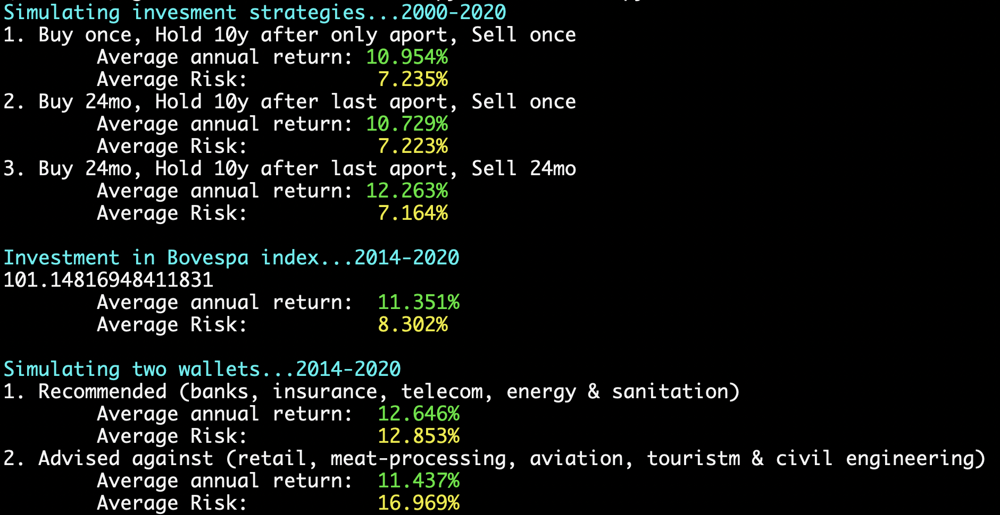

```sh
python src/main.py
```

A prova de balas

> São setores perenes, com produtos ou serviços tão essenciais que, 
> independentemente do cenário, recuperam mais rápido, ou sofrem menos durante 
> uma crise. 
> - Louise Barsi

- bancos;               (ex: Bradesco (BBDC4) e Banco do Brasil (BBAS3))
- seguros;              (ex: Sul América (SULA11) e BB Seguridade (BBSE3))
- telecomunicações;     (ex: Telefônica (VIVT4) e Telebrás (TELB4))
- energia;              (ex: Copel (CPLE3) e CPFL energia (CPFE3))
- saneamento.           (ex: sanepar (SAPR3) e sabesp (SBSP3))


A prova de Barsi
> "É só olhar a montanha russa, como sofreram as empresas de commodities, 
> construção civil e aviação, que estão no olho do furacão nesta crise na 
> pandemia"
> - Louise Barsi.

- varejo;               (ex: Lojas Americas (LAME4) e Via Varejo (VVAR3))
- frigoríficos;         (ex: Brasil Foods (BRFS3) e JBS (JBSS3))
- aviação e turismo;    (ex: Gol (GOLL4) e CVC (CVCB3))
- construção civil.     (ex: Cyrela (CYRE3) e Direcional Engenharia (DIRR3))

We simulated both wallets and here is the outcome: (spoiler: Barsi is right!)



Other infos:


_notes:_   
_Often enough competing companies will showcase a negative correlation
around the time of an important announcement. That said, the previous matrix
represents ~20 years of data, so we are not going to see this very narrow-timed
correlations._     
_Also, there are no negative numbers closer to -1 than to 0 because
we are biased by S&P 500, meaning that given two stocks with that correlation,
only one would be in the S&P 500, because the other would have had a dip in
price and would be removed from S&P 500 long before getting close to -1._


